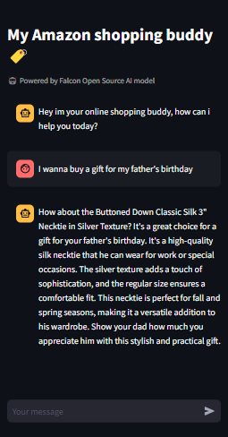

# Shopping Buddy

## Overview:

This project leverages [Falcon LLM](https://falconllm.tii.ae/), [OpenAI](openai.com) API, [Sentence Transformer](https://www.sbert.net/docs/installation.html#install-sentencetransformers), [Hugging Face Hub](https://huggingface.co/) and [Streamlit](https://docs.streamlit.io/) to build and deploy a chatbot shopping assistant application. It relies on a dataset of Amazon products to provide tailored product recommendations aligned with user's needs. The application uses [Langchain](https://www.langchain.com/) to integrate those diverse functionalities. Data preprocessing, embedding generation, and storage in Redis are also essential components of this project.
More details about the project are provided in [this blog post](insertalink.com).  
You can test the application by visiting the [Shopping Buddy](https://huggingface.co/spaces/RomyMy/EcomShoppingBuddy).  

## Table of Contents

- [Shopping Buddy](#shopping-buddy)
  * [Overview](#overview)
  * [Installation & Setup](#installation--setup)
    + [1. Clone the Repository](#1-clone-the-repository)
    + [2. Install Dependencies](#2-install-dependencies)
    + [3. Environment Variables](#3-environment-variables)
    + [4. Data Preprocessing](#4-data-preprocessing)
  * [Running the Application](#running-the-application)
  * [Contributing](#contributing)


## Installation & Setup

### 1. Clone the Repository

```bash
git clone git@github.com:romaissaMe/shopping-buddy.git
cd shopping-buddy
```

### 2. Install Dependencies

```bash
pip install -r requirements.txt
```

### 3. Environment Variables

Set up your environment variables. This project uses the `dotenv` library to manage environment variables. Create a `.env` file in the root directory:
```bash
cp .env_example .env
```

and add the following variables:

```bash
HUGGINGFACEHUB_API_TOKEN=your_huggingface_api_token
OPENAI_API_KEY=your_openai_api_key
REDIS_HOST=your_redis_host
REDIS_PORT=your_redis_port
REDIS_KEY=your_redis_key
```

### 4. Data Preprocessing

Before running the main application, preprocess and import your data into a database using:

```bash
python preprocess.py
```

Download the data as csv file from [here](https://drive.google.com/file/d/1tHWB6u3yQCuAgOYc-DxtZ8Mru3uV5_lj/view) and name it 'product_data.csv'.
This dataset comprises Amazon products information including item ID, item name, item keywords, product type...

## Running the Application

Once the setup is complete, you can run the main application using:

```bash
streamlit run app.py
```

This will launch the Streamlit application, and you can access the chatbot via the provided URL.



## Contributing

If you're looking to contribute to this project, kindly follow the standard GitHub workflow:

1. Fork the repository.
2. Create a new branch for your feature or fix.
3. Commit your changes and open a pull request.
4. Ensure that your code adheres to the project's style and standards.
